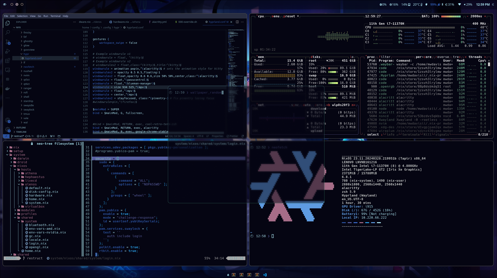
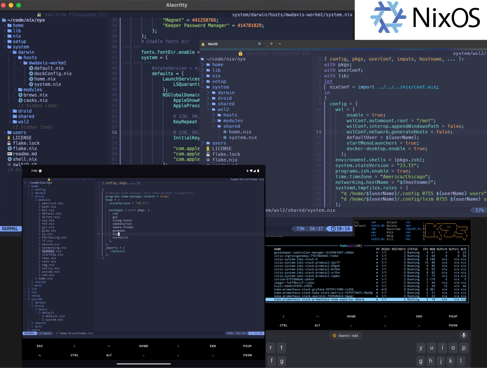

# Nixos + DotFiles

This is my personal configuration that I use for Nixos, WSL on Windows, MacOS, and my PixelFold.

## Hyprland



## Multi-platform Shells



## Overview

The general approach here is to isolate my user configuration into `home` folder and system configurations in the `system` folder. There are some deviations from this. For instance, all of the secrets are user based, but they are decrypted from the system configuration because we get more control from agenix (owner and group permissions) and I have found this approach does not require any custom activations or a restart of wsl.

I have used this repo for shell environments over the last couple of years or so but I've gotten carried away with hyprland and desktop tiling over the last few months. I've tried to put everything desktop related in the `nyx.modules.desktop` configuration space under home-manager. Most of the options are specified in in the `/systems/<platform>/hosts/<hostname>/home.nix` file. You can delete the entire desktop section if you don't want any your desktop to be modified.
The exceptions to this are:

- Nixos
  - Hyprland => `system/nixos/modules/hyprland`
  - Hyprlogin => `system/nixos/modules/hyprlogin`
  - Yubilogin => `system/nixos/modules/yubilogin`

- Darwin
  - Yarbai => `system/darwin/modules/system/yabai`
  - Dock => `system/darwin/modules/dock`
  - Brews => `system/darwin/brews.nix`
  - Casks => `system/darwin/casks.nix`

## General Project Structure

```Markdown
.
├─ home    # Home-manager and user configrations
├─ lib     # Shared functions that generate attribute sets
├─ nix     # Default Nix Configurations and Overlays
├─ setup   # Intitial Install/Configure Scripts
├─ system  # System / Host / Global configurations
```

## Influences, Inspirations & Credits

These public repositories heavily influenced my configuration. The project architecture and most of the dot files in this project started directly from EdenEast's public nix configuration. I am sure I missed someone's repo in the list, but I'm trying to give credit where credit is due. 

### Nix

- [EdenEast/nyx](https://github.com/EdenEast/nyx)
- [dustinlyons/nixos-config](https://github.com/dustinlyons/nixos-config)
- [LGUG2Z/nixos-wsl-starter](https://github.com/LGUG2Z/nixos-wsl-starter)

### Hyprland / Waybar / dotFiles

- [HeinzDev/Hyperland-dotfiles](https://github.com/HeinzDev/Hyprland-dotfiles)
- [linuxmobile/hyperland-dots](https://github.com/linuxmobile/hyprland-dots)
- [xsghetti/HyprCrux](https://github.com/xsghetti/HyprCrux)
- [justinmdickey/publicdots](https://github.com/justinmdickey/publicdots/tree/main)

### Amethyst / Yabai / Hammerspoon

- [ianyh/Amethyst](https://github.com/ianyh/Amethyst)
- [julian-heng/yabai-config](https://github.com/julian-heng/yabai-config)
- [breuerfelix/dotfiles](https://github.com/breuerfelix/dotfiles)

## Installation & Configuration

### My Configured Hosts

Below are descriptions of the hosts configurations. If you have access to windows / wsl, I recommend wsl/hosts/nixos.

```Markdown
├─ system
├─── darwin
├───── hosts
├─────── mwdavis-workm1 # => Work Macbook / 2022 16" Pro M1
├─── droid
├───── hosts
├─────── default        # => Google Pixel Fold
├─── nixos
├───── hosts
├─────── ares           # => Personal WSL w/ personal credential decryption
├─────── athena         # => Personal laptop - Alienware m15 R6 / i7 / RTX 3080 / nixos only
├─────── hephaestus     # => Home machine - Custom Build / i9 / AMD 7900xt / dual boot nixos+win
├─────── livecd         # => Bootable installer ISO w/ custom shell
├─────── olenos         # => Work laptop - Thinkpad x13 / i7 / integrated graphics / nixos only
├─────── virtualbox     # => Oracle Virtualbox Image (Gnome + Shell)
├─────── nixos          # => Generic WSL2
```

### Secrets Configuration

This repository uses [ryantm/agenix](https://github.com/ryantm/agenix) to manage secrets. The secrets are stored as encrypted age files in a private repository. To run this as is, you will need to either remove all references to secrets or create your own secrets repository.

The easiest way to run this is to update 'flake.nix` to use my [nix-secrets-example](https://github.com/mwdavisii/nix-secrets-example) repository.
Replace this:

```nix
secrets = {
      url = "git+ssh://git@github.com/mwdavisii/nix-secrets.git";
      flake = false;
    };
```

with this:

```nix
secrets = {
      url = "git+https://git@github.com/mwdavisii/nix-secrets-example.git";
      flake = false;
    };
```

Then make sure the options in '/system/$darwin or $wsl2>/hosts/$hostname/default.nix are all marked false as shown below. This will maintain the secrets skeleton, but should not error since no decryption configuration is provided.

```nix
  nyx = {
    modules = {
      user.home = ../../shared/home.nix;
    };

    secrets = {
      awsSSHKeys.enable = false;
      awsConfig.enable = false;
      userSSHKeys.enable = false;
      userPGPKeys.enable = false;
    };

    profiles = {
      desktop = {
        enable = true;
      };
    };
  };
```

If you want to actually build and decrypt secrets, here is what my secrets repository looks like:

```Markdown
.
├─ secrets.nix    # The secrets file you're instructed to create in this tutorial => https://github.com/ryantm/agenix?tab=readme-ov-file#tutorial
├─ encrypted      # Subdirectory to hold encrypted files
├─── id_ed25519.age files  # Example encrypted file
```

** Note that if the repository is private and you're using sudo, it will be looking for the github ssh key in the `/root/.ssh` directory and not your user directory.

### WSL2 Installation

1. Make sure you have WSL enabled and installed. [Click here if you need help setting up basic WSL2.](https://learn.microsoft.com/en-us/windows/wsl/install)
2. Make sure you have git installed in windows. You can download it [here.](https://git-scm.com/downloads)
3. Open up a PowerShell window
4. Clone this repo and start the windows side of the installation by executing [start_here.ps1](https://github.com/mwdavisii/nyx/blob/main/setup/wsl/start_here.ps1).

```powershell
git clone https://github.com/mwdavisii/nyx.git
set-location ./nyx/setup/wsl
./start_here.ps1
```

5. You should now be in your windows user directory, but in the NixOS shell. Move back into the startup directory and launch [step2.sh](https://github.com/mwdavisii/nyx/blob/main/setup/wsl/step2.sh).

```shell
cd ./nyx/setup/wsl
./step2.sh
```

**Note**
Some users have reported a shell error when running step 2. If you see an error message that contains `\r`, it's likely git converted line breaks to windows format. I think it's caused b having `git config --global core.autocrlf` set to `true` on windows. If this happens, the easiest thing to do is go to your home directory `cd ~` and clone another copy of the repo through nix (commands below). If you do this this, don't forget to update your secrets.

```shell
sudo nix-channel --add https://nixos.org/channels/nixos-23.11 nixos
sudo nix-channel --update
nix-shell -p git vim 
git clone https://github.com/mwdavisii/nyx
```

After this, you shou be able to continue to step 6.

6. Before running the last step, open ./flake.nix in your favorite text editor and look for the lines below and change the following values:

- **displayName** => Display Name used in GitHub config
- **email** => Display Name used in GitHub config`
- **signingKey** => The key used to sign git commits. (you can leave blank)`
- **windowsUserDirName** => This is the folder name of your windows profile. It is used to create the symlink from WSL to VS Code and add it to your path.

****Note:*** Leave the userName as nixos for wsl unless you know how to configure non-default users in nixos for WSL. As of now, it requires building from [nix-community/NixOS-WSL](https://github.com/nix-community/NixOS-WSL) which is more than I care to tackle at the moment.

```nix
{
  userName = "nixos";
  email = "mwdavisii@gmail.com";
  displayName = "Mike D.";
  signingKey = "5A60221930345909";
  windowsUserDirName = "mwdav";
}
```

7. Finally, run the last script, [step3.sh](https://github.com/mwdavisii/nyx/blob/main/setup/wsl/step3.sh).

```shell
./step3.sh
```

Now close the current shell and open a new one. After the initial install, you can apply updates by executing the refresh script.

``` shell
./switch.sh #Rebuilds and switches to the home environment.
```

### MacOS Installation

1. Make sure you have git installed. You can download it [here.](https://git-scm.com/downloads)
2. Clone this repository.

```shell
git clone https://github.com/mwdavisii/nyx.git
cd ./nyx/macos
```

3. Launch the installation script

```shell
./start_here.sh
```

4. Copy the `./users/mwdavisii.nix` file into a new file with your username. Then use your favorite text editor and update the information in the file. You can safely ignore the windowsUserDirName value, that is exclusively for WSL2 and VS Code.

- **displayName** => Display Name used in GitHub config
- **email** => Display Name used in GitHub config`
- **signingKey** => The key used to sign git commits. (you can leave blank)`

```nix
{
  userName = "mwdavisii";
  email = "mwdavisii@gmail.com";
  displayName = "Mike D.";
  signingKey = "5A60221930345909";
  windowsUserDirName = "";
}

```

5. Edit the `./flake.nix` file and look for the following lines. Change the user to the user you created above and if you are running an intel mac, change `aarch64-darwin` to `x86_64-darwin`.

```nix
darwinConfigurations = mapAttrs' mkDarwinConfiguration{
        mwdavis-workm1 = {system = "aarch64-darwin"; user = "mwdavisii";};
      };
```

6. Apply the changes

```shell
./step2.sh
```

7. Now close the current shell and open a new one. After the initial install, you can apply updates by executing the refresh script.

```shell
./switch.sh #Rebuilds and switches to the home environment.
```

### Virtual Machines

I've created a virtualbox host and am using [nix-community](https://github.com/nix-community/nixos-generators) to build. It supports all kinds of outputs. My plan was to create a host for each platform I care about and continue to use `nixosModules ++ commonModules` in `lib/default.nix` and `flakes.nix` to define the configurations.

### Android Installation

1. You will need to install [Nix-on-Droid from f-droid](https://f-droid.org/en/packages/com.termux.nix/)
2. Go into the root of the initial installation and edit `~/.config/nixpkgs/nix-on-droid.nix` to add 'git' to the packages
3. run `nix-on-droid switch --flake .` from the directory with `flake.nix` in it.
4. Once complete, run `git clone https://github.com/mwdavisii/nyx.git`
5. Run `cd nyx` and the run `nix-on-droid switch --flake .`

**Notes On NixOnDroid** NixOnDroid is still rudimentary and doesn't have full support for attrs and other functions yet. Because of that, it doens't follow the same `mkAttrs` into `options` for build. It just looks at the files in `home/droid/modules` and runs the configuration there. You can see many of the modules are simplified for this environment.

## Tips

I have over 150+ commits in the last week. I am not new to declarative systems and have been using git ops strategies since they had a name. Nix was brand new to me and trying to pick up Nix + Flakes + Attributes at the same time was difficult. I can't tell you how many times I've typed `git reset --hard` or `nix-on-droid rollback`.

Here are some things that would have shortned my learning curve:

### Recommended Reading

- [EdenEast's Nyx Readme](https://github.com/EdenEast/nyx/blob/main/readme.md) 
- [Introduction to Nix & NixOS](https://nixos-and-flakes.thiscute.world/introduction/)
- [An Introduction to Nix Flakes](https://www.tweag.io/blog/2020-05-25-flakes/)
- [Flakes aren't real and cannot hurt you: a guide to using Nix flakes the non-flake way](https://jade.fyi/blog/flakes-arent-real/)

### My Nix, Flake, and mkAttr Gotchas

- There is a lot of basic documentation and examples for nixos, flakes, and most modules. However, when introducing attribute sets, I found it more difficult to apply the published examples to the more complex approach. There was a lot of looking at other peoples repos, asking gemini for help, and a good bit of trial and error.
- I tried to be pure, but quickly found out the variation between systems and packages didn't always allow it.
  - For instance, I would have put all user secrets inside of `home/` instead of `system/`, but I kept having issues with [ryantm/agenix](https://github.com/ryantm/agenix) in home manager, and didn't want to use a custom activation script.
- Rollback a build that successfuly failed by executing `nixos-rebuild switch --rollback` or `darwin-rebuild switch --rollback` or `nix-on-droid rollback`.
  - I was frequently wiping and rebuilding the entire system before I knew this.
- In regards to `nyx.modules`, `nyx.profiles`, and `nyx.secrets`
  - In each `mk${system}Configuration`, the lines below actually create the root options (`config.nyx.profiles`, `config.nyx.modules`,  and `config.nyx.secrets`).
  - These options are set in `system/$system/hosts/$hostname/default.nix`.
  - These options are applied from various subdirectories:
    - Secrets (`config.nyx.secrets`) are applied from `system/shared/secrets`
    - Profiles (`config.nyx.profiles`) are applied from `system/shared/profiles`
    - Modules (these are applied by home-manager)
      - App Modules (`config.nyx.modules.app`) are applied from `home/shared/modules/app`
      - Dev Modules (`config.nyx.modules.dev`) are applied from `home/shared/modules/dev`
      - Shell Modules (`config.nyx.modules.shell`) are applied from `home/shared/modules/shell`

Example from `lib/default.nix`:

```nix
  (import ../system/nixos/shared/modules)
  (import ../system/shared/profiles)
  (import ../system/shared/secrets)
  (import (strToPath config ../in/hosts))
```

Example from `system/$system/hosts/$hostname/default.nix`:

```nix
  nyx = {
    modules = {
      user.home = ./home.nix;
    };
    secrets = {
      awsSSHKeys.enable = true;
      awsConfig.enable = true;
      userSSHKeys.enable = true;
      userPGPKeys.enable = true;
    };
    profiles = {
      desktop = {
        enable = true;
      };
    };
  };
```
